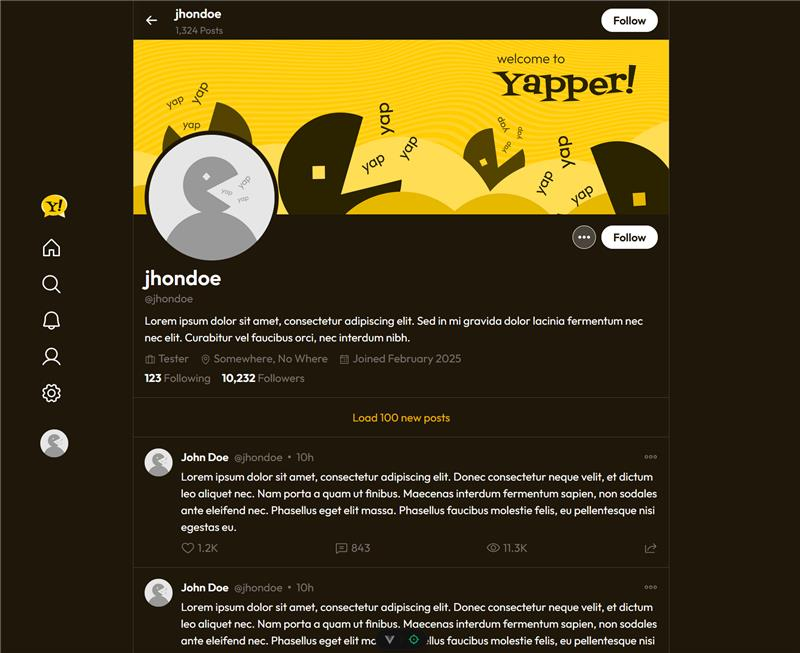
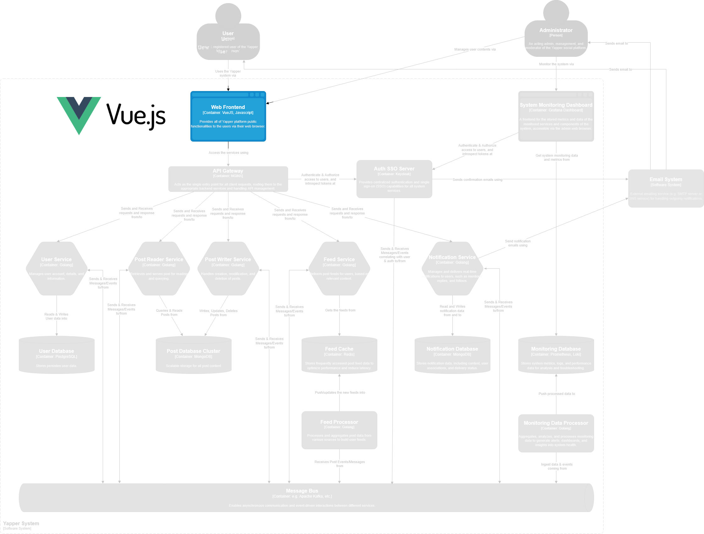

<div align="center">


> A simple social platform to view and post short text messages (Yaps).
> <br><small>(i.e., an X (Twitter), BlueSky, Threads clone)</small>

<b>Frontend</b> |
<a href="">Observability Stack</a><br>
<a href="https://github.com/fateh-ark/yapper-user-service">User Service</a> |
<a href="">Post Service</a> |
<a href="">Feed Service</a><br>
<a href="https://github.com/fateh-ark/yapper-middlewares">Middlewares</a>

</div>

---

#  Yapper Frontend



This repository contains the source codes for the front-end of Yapper! system. Developed using VueJS. The front-end could be build and run locally for development or testing.



#### Demo

> To be added at the next sprint.

#### Relevant Documentations

- System Requirements Documentation
- Design Documentation

#### Open Issues

- [ ] Finish Readme Documentation
- [ ] Gitlab CI/CD Pipeline Setup

## Local Development & Testing

### Prerequisites

In order to run the web client within your local environment, you must have the following set up or configured:

- Have the following installed/available:
  - Node.js
  - Vite
  - A Chromium-based, Firefox, or Safari browser.

Additionally you may need to have the other services/repos up and running withing your environment in order to use the full functionality of the system.

### Running the client

To run the client in development, run the following command:

```sh
npm run dev
```

### Building the Client

To build the web client, run the following command:

```sh
npm run build
```

## Cloud Deployment

> TBA at a later sprint.
